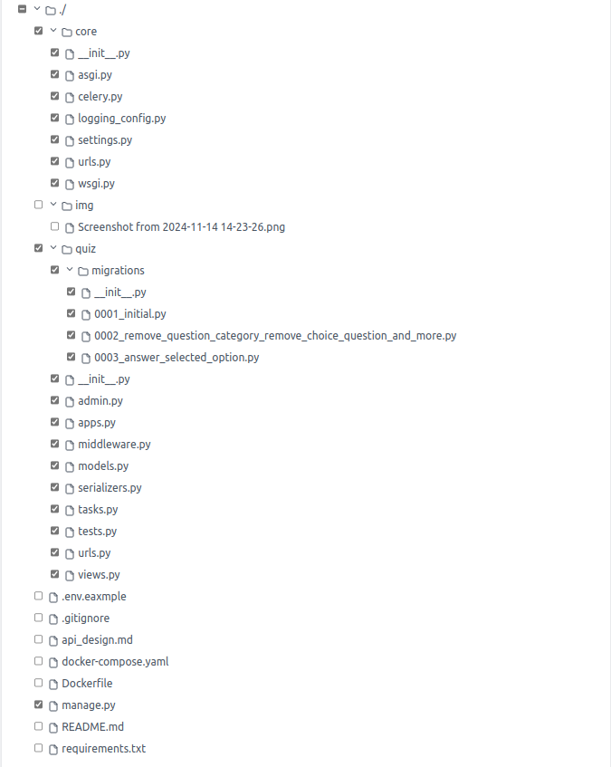

# QuizBit

This project is a RESTful API for managing quizzes and user responses using Django and Django REST Framework.

## Features

- User authentication with JWT
- CRUD operations for quiz questions
- Track user practice history
- API documentation with Swagger and Redoc

## Installation

1. **Clone the repository**:
   ```bash
   git clone https://github.com/yourusername/django-restfulframework-quizbit.git
   cd django-restfulframework-quizbit
   ```


- **Install Dependencies**
```bash
# Create a virtual environment
python3 -m venv env

# Activate the virtual environment
source env/bin/activate  # On Windows, use: venv\Scripts\activate

# Install dependencies
pip install -r requirements.txt
```

- **Configure the Database**
```bash
python manage.py migrate
```

- **Create a Superuser**
```bash
python manage.py createsuperuser
```
- **Run the Development Server**
```bash
python manage.py runserver
```

- **Using Docker**
- **build the docker image**
```bash
docker-compose build
```
- **Run the docker containers:**
```bash
docker-compose up
```
## Directory

[](https://github.com/Sagor0078/django-restfulframework-quizbit)


## Clean Code and Modularity

The codebase follows several clean code and modular programming principles, which contribute to its maintainability, readability, and scalability. Here are some of the key principles and patterns observed:

- **Separation of Concerns**

The codebase separates different aspects of the application into distinct modules. For example, models are defined in `models.py`, serializers in `serializers.py`, views in `views.py`, and URL routing in `urls.py`.

- **Single Responsibility Principle**

Each class and function has a single responsibility. For example, the `QuestionListView` class is responsible for listing questions, and the `SubmitAnswerView` class is responsible for handling the submission of answers.

- **Modularization**

The code is organized into modules, each with a specific purpose. This makes it easier to manage and extend the codebase. For example, the serializers are defined in a separate module (`serializers.py`), which handles the conversion of model instances to JSON format.

- **Use of Class-Based Views**

The use of class-based views (CBVs) in Django promotes reusability and modularity. CBVs allow you to encapsulate related functionality into a single class, making the code more organized and easier to extend.

- **Encapsulation**

The code encapsulates related functionality within classes and methods. For example, the `SubmitAnswerView` class encapsulates the logic for handling answer submissions, including validation, saving the answer, and updating practice history.

- **Descriptive Naming**

The code uses descriptive names for classes, methods, and variables, which makes it easier to understand the purpose of each component. For example, `QuestionListView`, `SubmitAnswerView`, and `PracticeHistorySerializer` clearly indicate their roles.

- **Error Handling**

The code includes error handling to manage different scenarios, such as missing or invalid data. This improves the robustness of the application.

- **Use of Django REST Framework (DRF)**

The codebase leverages Django REST Framework (DRF) to create a clean and modular API. DRF promotes modularity and clean code practices by providing tools for building APIs, such as serializers, viewsets, and routers.


The codebase primarily follows the **Strategy** design pattern, which is evident in the way Django handles views and serializers. Here’s how the Strategy pattern is applied:

- **Strategy Pattern**

The Strategy pattern defines a family of algorithms, encapsulates each one, and makes them interchangeable. The pattern lets the algorithm vary independently from clients that use it.


